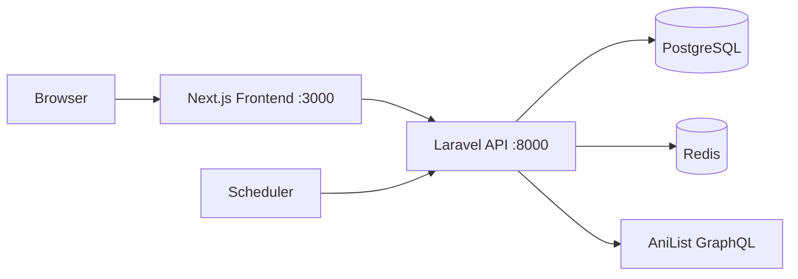

# AnimeVault

<p align="center">
  
</p>

<p align="center">
  <strong>Descubre, organiza y explora anime y manga desde una sola plataforma.</strong>
</p>

<p align="center">
  AnimeVault combina descubrimiento, seguimiento personal, perfiles publicos, notificaciones de episodios y un entorno local con Docker listo para levantar todo el stack en minutos.
</p>

<p align="center">
  
  
  
  
  
  
  
</p>

---

## Que es AnimeVault

AnimeVault es una plataforma full-stack inspirada en experiencias como AniList o MyAnimeList, pero con identidad propia, UI moderna y una arquitectura preparada para evolucionar como producto real. Desde una sola app puedes:

- descubrir anime y manga
- navegar por secciones trending, seasonal y top rated
- usar filtros avanzados y busqueda
- gestionar perfiles publicos o privados
- llevar tu biblioteca personal con progreso por episodios
- marcar favoritos, recibir notificaciones y ajustar preferencias
- consumir una API versionada con Laravel
- refrescar el catalogo automaticamente mediante sincronizacion con AniList

## Funcionalidades destacadas

- **Inicio conectado al catalogo**: hero destacado, trending now, selecciones de temporada, generos y ranking top rated.
- **Fichas completas de anime y manga**: relaciones, personajes, staff, trailers y metadatos ricos.
- **Seguimiento personal real**: estados como watching, completed, paused, dropped o planning, con progreso y puntuacion.
- **Perfiles de usuario**: avatar, banner, biografia, zona horaria, privacidad y preferencias de visualizacion.
- **Notificaciones**: avisos de nuevos episodios para series que sigues.
- **Backend API-first**: REST versionado en `/api/v1`, autenticacion con Sanctum y soporte OpenAPI.
- **Docker-first**: frontend, backend, PostgreSQL, Redis y scheduler ya integrados en Compose.

## Stack tecnologico

| Capa | Tecnologias |
| --- | --- |
| Frontend | Next.js 16, React 19, TypeScript, Tailwind CSS 4, TanStack Query, Radix UI, Sonner |
| Backend | Laravel 13, PHP 8.5, Sanctum, L5 Swagger / OpenAPI |
| Datos | PostgreSQL 18, Redis 8.6 |
| DevOps | Docker, Docker Compose, hot reload con volumenes |
| Fuente externa | AniList GraphQL para importaciones y refrescos |

## Arquitectura



## Estructura del proyecto

```text
animevault/
├── frontend/          # App Next.js
├── backend/           # API Laravel + importadores + scheduler
├── db/                # Backups SQL opcionales
├── docker-compose.yml # Stack local completo
└── README.md
```

## Levantar AnimeVault en local con Docker

AnimeVault ya incluye una configuracion Docker funcional. Para trabajar en local no necesitas instalar manualmente PHP, Composer, Node, pnpm, PostgreSQL ni Redis en tu maquina.

### Requisitos

- Docker
- Docker Compose

### 1. Levanta el stack completo

```bash
docker compose up --build -d
```

Esto inicia:

- `frontend` en el puerto `3000`
- `backend` en el puerto `8000`
- `pgsql` en el puerto `5432`
- `redis` en el puerto `6379`
- `scheduler` para refrescos automaticos

### 2. Abre la aplicacion

- Frontend: `http://localhost:3000`
- Backend API: `http://localhost:8000/api/v1/ping`

### 3. Que hace Docker automaticamente

Al arrancar, el proyecto resuelve por ti buena parte del setup:

- instala dependencias del frontend con `pnpm`
- instala dependencias del backend con `composer`
- crea el `.env` del backend desde `.env.docker.example` si no existe
- genera la `APP_KEY` de Laravel
- espera a que PostgreSQL y Redis esten disponibles
- ejecuta las migraciones de base de datos
- crea el symlink de `storage` para Laravel

En otras palabras, el arranque normal de primer uso suele ser solo esto:

```bash
docker compose up --build -d
```

## Poblar el catalogo

Si arrancas con una base vacia, la interfaz puede iniciar antes de que existan datos suficientes en el catalogo. AnimeVault incluye comandos reales de importacion desde AniList para poblar la base local.

### Importacion rapida

```bash
docker compose exec backend php artisan anilist:import-anime --limit=200 --use-cursors
docker compose exec backend php artisan anilist:import-manga --limit=200 --use-cursors
```

### Refrescar trending y emisiones manualmente

```bash
docker compose exec backend php artisan anilist:refresh-trending-anime
docker compose exec backend php artisan anilist:refresh-airing-anime
```

### Recuperar mangas faltantes

```bash
docker compose exec backend php artisan anilist:sync-missing-manga --start-id=1 --max-id=5000
```

## Servicios y puertos

| Servicio | Puerto | Proposito |
| --- | --- | --- |
| Frontend | `3000` | Aplicacion Next.js y entrada principal en navegador |
| Backend | `8000` | API Laravel, auth, perfiles y endpoints del catalogo |
| PostgreSQL | `5432` | Base de datos principal |
| Redis | `6379` | cache, sesiones y almacenamiento auxiliar |
| Scheduler | interno | sincronizaciones y refrescos periodicos |

## Comandos utiles de Docker

### Ver logs

```bash
docker compose logs -f frontend
docker compose logs -f backend
docker compose logs -f scheduler
```

### Ejecutar tests y chequeos

```bash
docker compose exec backend php artisan test
docker compose exec frontend pnpm lint
```

### Abrir una shell dentro de un contenedor

```bash
docker compose exec backend bash
docker compose exec frontend bash
```

### Detener el proyecto

```bash
docker compose down
```

### Detener y borrar volumenes

Usa esto solo si quieres reiniciar la base de datos, los datos de Redis y las dependencias persistidas en volumenes de Docker.

```bash
docker compose down -v
```

## Documentacion de la API

El backend incluye anotaciones OpenAPI y generacion de Swagger.

### Generar Swagger

```bash
./backend/swagger.sh
```

O, si prefieres hacerlo manualmente:

```bash
docker compose exec backend php artisan l5-swagger:generate
```

Tras generarlo, la documentacion queda disponible en:

```text
http://localhost:8000/api/documentation
```

## Notas para desarrollo local

- El frontend usa volumenes Docker para desarrollo en vivo y hot reload.
- El backend usa Redis para cache y sesiones en este entorno Docker.
- El scheduler corre por separado para no bloquear el contenedor principal de la API.
- El frontend ya viene configurado para hablar con el backend mediante `NEXT_PUBLIC_API_URL` e `INTERNAL_API_URL` definidos en `docker-compose.yml`.

## Por que este setup esta bien resuelto

AnimeVault esta planteado para comportarse como un producto real incluso en desarrollo local:

- interfaz con identidad propia y sistema visual reutilizable
- separacion clara entre frontend y backend
- servicios persistentes de Postgres y Redis
- migraciones automaticas al arrancar
- sincronizacion en segundo plano con un scheduler dedicado
- tooling de importacion para trabajar con un catalogo realista

## Licencia

Este repositorio se distribuye bajo los terminos descritos en [LICENSE.md](./LICENSE.md).
